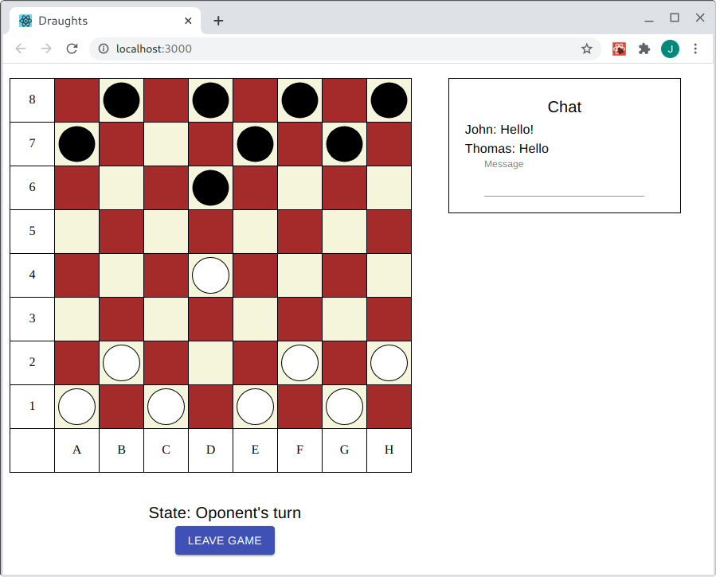

# Draughts


This project provides a simple implementation of the game Draughts. It allows multiple users to
play this game in their browsers over the network. The user can set his nickname and wait for
or choose the opponent. The application frontend implemented in React connects to a simple backend
implemented in the Go programming language.

## Run using published binaries

Download a binary file for your computer architecture and operating system
from the latest [release page](https://github.com/jiripetrlik/draughts/releases) and run
the downloaded file. Open the application using a web browser on
http://localhost:8080.



## Run using published Docker image

Docker image for Draughts is available on Docker hub. It is
possible to start the application in Docker container using the
following command:

```
# Run Draughts in Docker container (Use http://localhost:8080 to connect)
docker run -d --name draughts-container -p 8080:8080 jiripetrlik/draughts
```

## Build

The project can be build using a traditional Makefile in the parent
directory. Use command `make` to build the project. The final result
is the `draughts-react-go` executable in the `backend` directory. To
clean up the project, type `make clean`.

```
# Build project
make

# Run the application (Use http://localhost:8080 to connect)
./backend/draughts-react-go

# Clean up project
make clean
```

## Create Docker images

The project contains a `Dockerfile` in the parent directory which
can be used for creating a Docker image. Run `docker build . -t draughts-image`
to build it.

```
# Create Docker image
docker build . -t draughts-image

# Run Draughts in Docker container (Use http://localhost:8080 to connect)
docker run -d --name draughts-container -p 8080:8080 draughts-image
```
